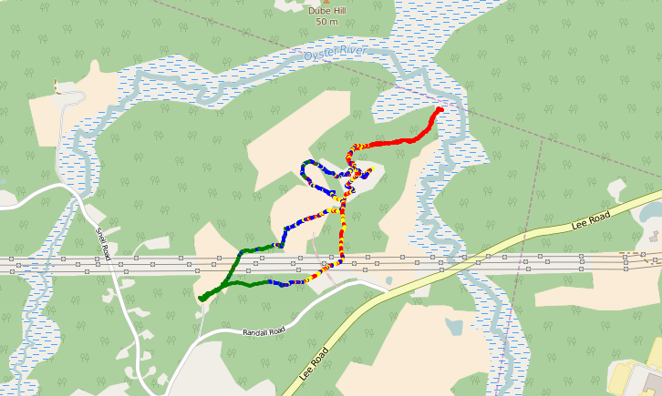
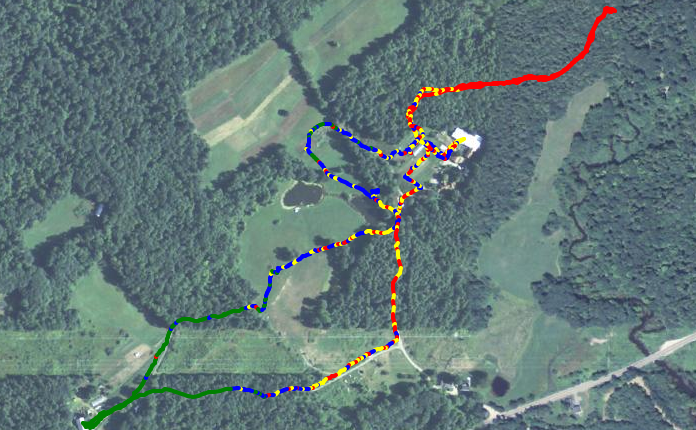

 


# Overview

This project involved logging sensor data to a file on a computer (in this case, remotely, via radio transmission) while simultaneously recording GPS location using a smartphone app.  Because GPS recording devices (like smartphones) are common, and generate KML or GPX files, the resultant problem may fairly common: how to easily combine GPS data (recording at some logging rate, on e.g. a smartphone) with a separately-recorded sensor data file (which may have been logged at some other rate, but overlaps in time with the GPS data).

Because we imagine that each part of this process might separately have useful application in various monitoring use-cases, we have broken our analysis into three main steps:

## Converting a gpx file to csv

The original gpx file, in XML format, can be converted to a simplified csv format that's easier to work with, using the format:

```
 unix epoch, latitude, longitude, elevation, speed 
```

We've done that in the notebook named [gpx_to_csv.ipynb](./gpx_to_csv.ipynb) .

## Combining gps data with logging data

The gps data (now in csv format, via the above transformation) can then be matched with the logging file by comparing timestamp information and finding the 'closest match'. 

We've done that in a notebook here: [timing_match.ipynb](./timing_match.ipynb) .

## Plotting the combined file on a map

Finally, the world-line of the logging data (in our case, the signal strength (RSSI) of a radio transmitter) can be embedded in a map.  

We've used the Folium library to do that here:  [folium_plot.ipynb](./folium_plot.ipynb) .

# Project details

This project was intended to test the range of transmission of a signal between two Moteinos in wooded farmlands.  We used two Moteinos (source code in the "Moteino_code" folder) outfitted with LoRa radios, set at the maximum broadcasting power ("23 dBm").  One Moteino was brought with a roving party that was also operating an Android app ("GPS Essentials") which recorded GPS location with associated timestamps;  the Moteino sent its RSSI signal strength to another Moteino located at the base station, located inside a barn, at a window.  The base station Moteino printed this RSSI data to the serial port of a laptop, which was read and timestamped by a Python script (in "logging_script").   
